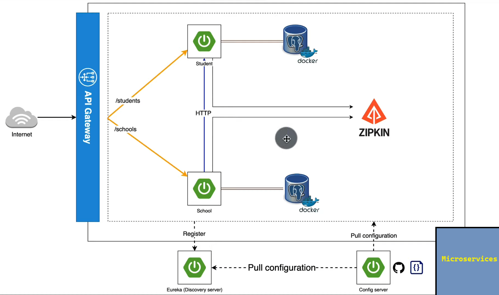
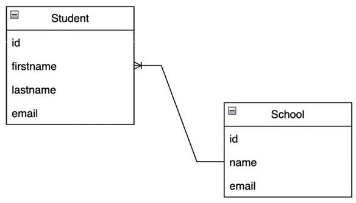

# [Microservices tutorial with Spring boot 3](https://www.youtube.com/watch?v=KJ0cSvYj41c)

La arquitectura de microservicios que trabajaremos en este tutorial se resume en el siguiente diagrama:

## Relación entre Students y Schools

